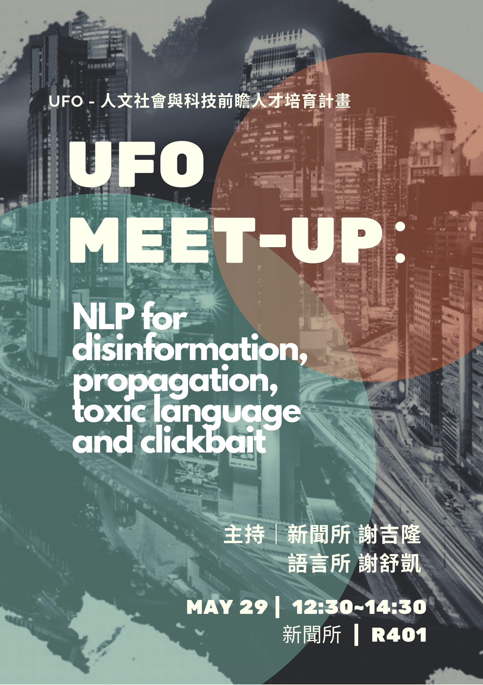

### 社會責任、倫理與自然語言處理

> 如果大家只關心科技發展的一個向度，那麼社會是岌岌可危的。

## 相關課程

- [Computational Ethics for NLP, CMU]( 
http://demo.clab.cs.cmu.edu/ethical_nlp/)

## 會議研究

- [1st ACL workshop on Gender Bias for NLP](
https://genderbiasnlp.talp.cat/)

## 性別偏見

- talk at 2019. AI 與性別論壇. 台大社科院. [slide](genderednlp.html)

## 仇恨語言、惡毒評論（語言病毒）

- talk at 2019. NLP for disinformation, propagation, toxic language and clickbait. [slide](nlp4if-forum.pdf)

